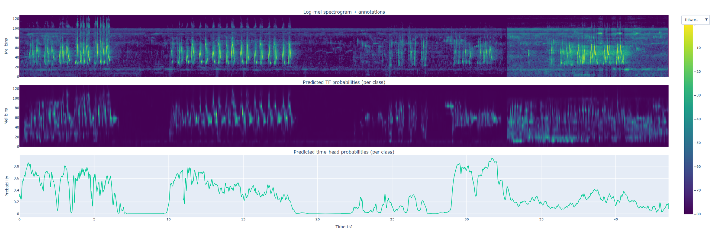
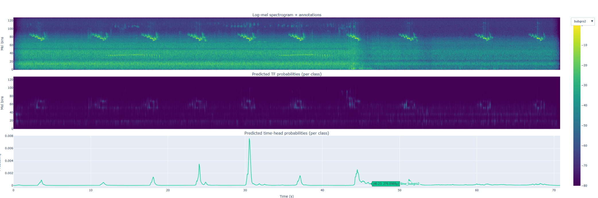
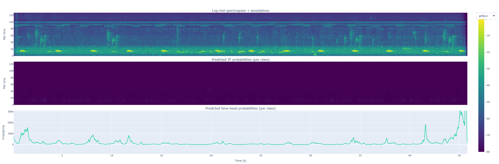
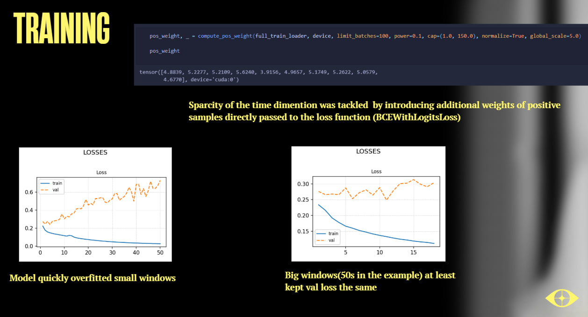

# OrniWatch — Passive Bird Species Detection via CRNN

A deep-learning system for passive acoustic monitoring of bird species. OrniWatch uses a **Convolutional Recurrent Neural Network (CRNN)** to detect bird vocalisations in long-form audio recordings, outputting per-frame predictions over time for each of 10 target species.

## Table of Contents

- [Project Overview](#project-overview)
- [Architecture](#architecture)
- [Installation & Setup](#installation--setup)

---

## Project Overview

OrniWatch addresses the problem of automated bird species identification from raw audio — a task with significant practical value for biodiversity monitoring, ecological surveys, and conservation research.

**Key characteristics:**

- **Input:** Long-form audio recordings (field recordings, autonomous recorders)
- **Output:** Per-timestep probability scores across 10 bird species (multilabel)
- **Target classes include:**
  - Amazonian Grosbeak *(South America)*
  - Gray-fronted Dove *(South America)*
  - Stock-dove *(Europe)*
  - Thrush-like Wren *(South America)*
  - Eurasian Blackcap *(Europe)*
  - *(+ 5 additional species)*
- **Challenge addressed:** Extreme label sparsity — positive label fraction ≈ 0.005 in the time dimension

**Data pipeline summary:**

1. Train and validation recordings are sourced from **strictly separate files** to prevent leakage.
2. 10 species classes were selected from the full dataset.
3. Long recordings are **segmented into short windows** according to the main annotation file.
4. Segments are **pre-computed and cached as tensors** for training efficiency.
5. Key preprocessing parameters:
   - `hop_length` — STFT hop size controlling temporal resolution
   - `n_mels` — number of mel filterbank bins
   - `window_len` (seconds) — segment length fed to the model
6. **Data augmentation** is applied to improve generalisation.

---

## Results & Observations

### Handling Label Sparsity

The extreme sparsity of the time dimension (positive label fraction ≈ 0.005) was tackled by introducing large positive-sample weights passed directly to `BCEWithLogitsLoss`. This upweights rare bird-call frames without requiring oversampling, and proved effective at directing gradient signal toward the relevant timesteps.

### Window Size and Overfitting

Small input windows caused the model to overfit rapidly — validation loss would diverge while training loss continued to fall. Increasing the window size to ~50 s at least kept validation loss stable, providing a workable training regime even under high label sparsity.

### Demonstration Results

**One class was particularly well detected**, (Thrush-like Wren) though a degree of background noise remains present in the predictions.



Two additional examples are worth noting from the manually gathered dataset:

- **Amazonian Grosbeak** — detections are reasonably clean and correlate well with actual vocalisations.
- **Gray-fronted Dove** *(South America)* — shows detectable activations despite **not being included in the 10 training classes**. This suggests the model has learned generalizable acoustic features that transfer to unseen species.





---

## Architecture

OrniWatch uses a **CNN + GRU hybrid** architecture (CRNN), designed for sequence-aware audio classification:

```
Raw Audio
    │
    ▼
Mel Spectrogram (hop_length, n_mels, window_len)
    │
    ▼
CNN Encoder  ─── extracts local spectro-temporal features per frame
    │
    ▼
GRU (Recurrent) ─── models temporal context across frames
    │
    ▼
Time Head (per-frame)   ←── primary training target
    │
    ▼
Sigmoid  ─── multilabel output (one score per class, per timestep)
```

**Key design decisions:**

| Decision | Rationale |
|---|---|
| GRU over LSTM | GRU size was the dominant factor in convergence speed; simpler architecture converged faster |
| Sigmoid over Softmax | Bird calls are not mutually exclusive; multiple species may vocalise simultaneously |
| Per-timestep (time head) training | Temporal label data was extremely sparse (pos fraction ≈ 0.005); clip-level head provided weaker signal |
| Positive sample weighting via `BCEWithLogitsLoss` | Directly counteracts class imbalance without requiring oversampling |
| Large input windows (~50 s) | Small windows caused rapid overfitting; longer context kept validation loss stable |

**Training observations:**

- More target classes increased training instability — GRU capacity must scale accordingly.
- Small input windows (e.g. < 10 s) caused the model to overfit rapidly.
- Positive-weight upsampling passed directly to `BCEWithLogitsLoss` was effective for sparsity.
- One species (Amazonian Grosbeak) achieved particularly clean detection; others showed higher false-positive rates.



---

## Installation & Setup

### Requirements

- Python ≥ 3.9
- PyTorch ≥ 2.0
- torchaudio
- librosa
- numpy, pandas, matplotlib
